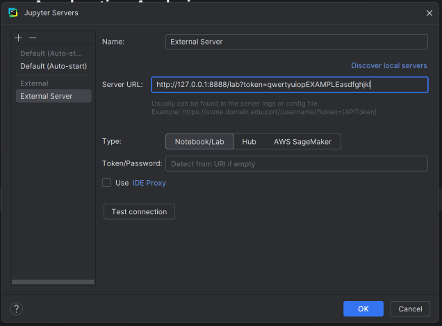

# data_analysis
UBC Solar's data analysis environment


## Requirements
1. Git (`git --version`) 
2. Git LFS (`git lfs --version`).
   1. Install with `brew install git-lfs` or similar.
3. Python 3.12 (`python3 --version`) 
4. uv (`uv --version`)

## Setting Up A New Project

### 1. Create a new branch

Choose a short, descriptive name for your project following the snake-case format, then check out a new branch.

```bash
git checkout main
git pull
git checkout -b your_project_name
```

You will now be on a new branch named `your_project_name`!

### 2. Copy the template

- **Copy the entire `project_template` folder** and paste it into the `v4` folder.
- **Rename your copied folder** to your project/branch name.
- **Rename your notebook**
  - If you have just one, you may give it the same name as the project.
    Otherwise, use a name that describes the specific purpose of the notebook(s).

In this example, my project is named `acceleration_analysis`.

```
data_analysis
└── v4
    └── acceleration_analysis
        ├── data
        ├── results
        ├── scripts
        ├── acceleration_analysis.ipynb
        └── PROJECT_TEMPLATE.md
```

### 3. Create a `uv` environment for your project

If you don't already have the `uv` package manager installed, you can run

```bash
# macOS/Linux
curl -LsSf https://astral.sh/uv/install.sh | sh

# Windows PowerShell
powershell -c \"irm https://astral.sh/uv/install.ps1 | iex\"
```

to install it.

Check if the installation worked with `uv --version`.
You may need to restart your terminal or computer for the command to work.

Next, `cd` into your project and initialize `uv`.

```bash
# macOS/Linux
cd v4/your_project_name
uv init --no-workspace --bare

# Windows PowerShell
cd .\v4\your_project_name
uv init --no-workspace --bare
```

This will create a `pyproject.toml` file in your project to track dependencies.

### 4. Install dependencies

Use `uv add package_name` to install packages you will need. For example,

``uv add numpy, matplotlib, ubc-solar-data-tools, pytz.

Use the packages that your project requires. Don't worry if you forget something, you can always `uv add` it later.

### 5. Open Jupyter

We want to run our Jupyter notebook _using_ our new uv environment.
For more info, see [Using uv with Jupyter](https://docs.astral.sh/uv/guides/integration/jupyter/#using-uv-with-jupyter).

First, create an IPython kernel with the following command,
replacing the name "project" with the name of your project.

```bash
# macOS/Linux
uv add --dev ipykernel
uv run ipython kernel install --user --env VIRTUAL_ENV $(pwd)/.venv --name="project"

# Windows PowerShell
uv add --dev ipykernel
uv run ipython kernel install --user --env VIRTUAL_ENV "$(Get-Location)\.venv" --name "project"
```

Next, start the server.

```bash
uv run --with jupyter jupyter lab
```

This will open the JupyterLab browser interface.
If you prefer to use your IDE (e.g. PyCharm or VSCode),
You may copy the server URL which was printed to the console and select it as an external server
in which to run your Jupyter Notebook.

